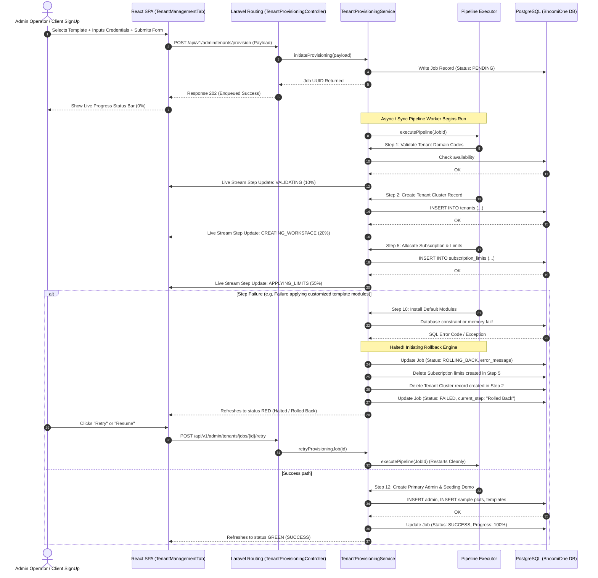

# BhoomiOne Zero-Touch Provisioning Sequence Diagram

This text-based/Mermaid sequence diagram outlines the pipeline workflow, and the rollback lifecycle when errors are encountered.

---

---

## Key Takeaways
1. **Unblocked Admin UX**: The enqueued process yields immediate interactive control back to the operator.
2. **Reverse Cleanup sequence**: Ensures strict referential integrity compliance on rollbacks.
3. **Flexible controls**: The same state pattern drives `Retry`, `Cancel`, and `Resume` triggers seamlessly.
